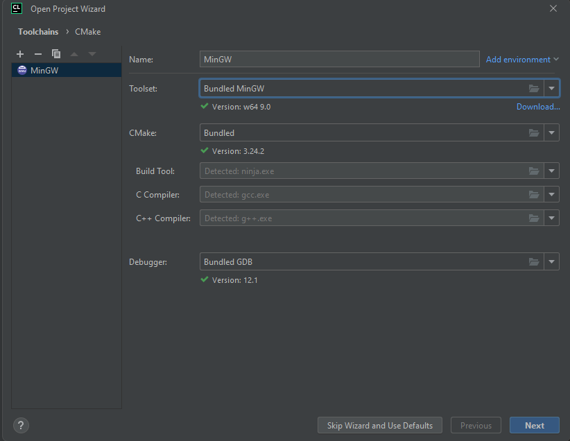
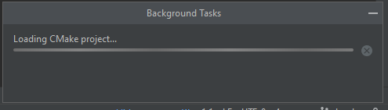
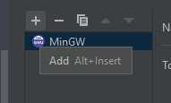
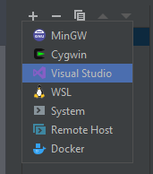
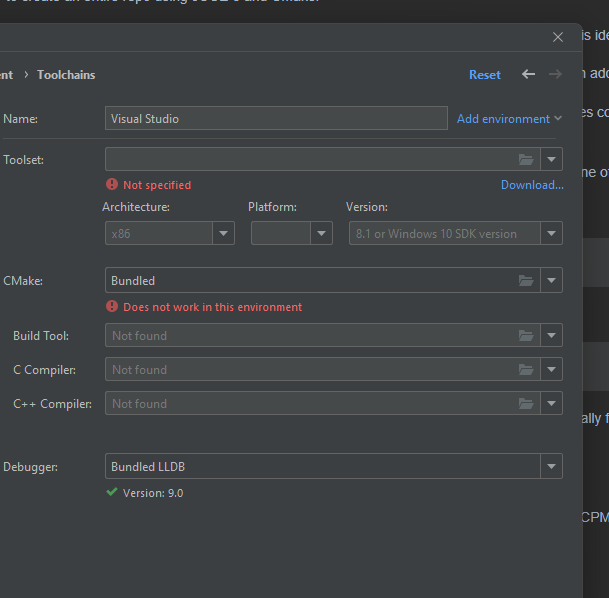
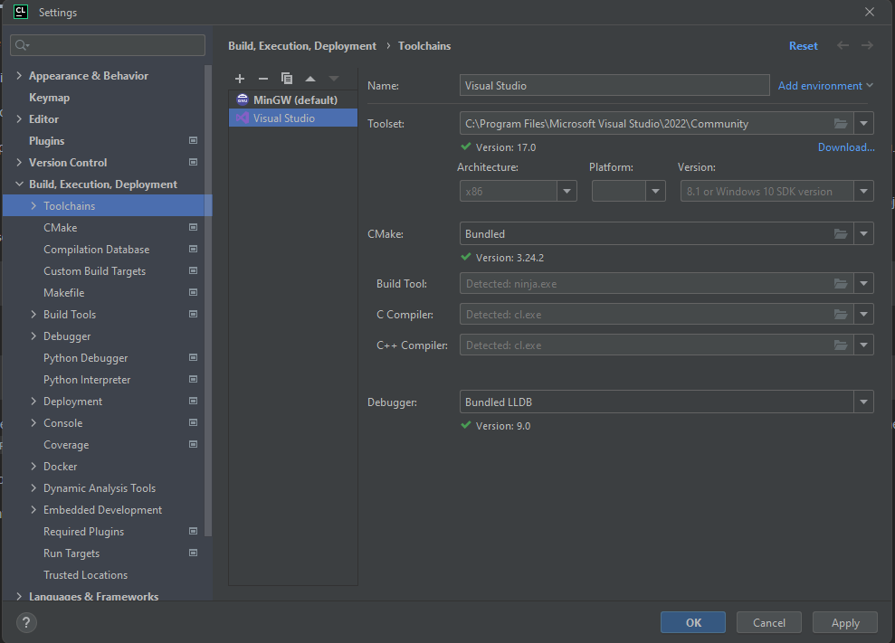

Fresh install of legacy CLion

Install legacy version of CLion, standard install from JetBrains site.

1. opening project in CLion


1. IDE loading CMake project, takes a while


1. Add a Visual Studio build system (Using MinGW may actually work but JUCE has some warnings for in `juce_graphics.cpp` about it)



1. Click Download to download visual studio and downloda the community version


1. Install only the _Desktop development with C++_ tools.


1. Make `dependencies` dir next to JUCECmakeRepoPrototype
1. Downloaded 0.2.2 win32 and win64 from https://github.com/libsndfile/libsamplerate/releases/tag/0.2.2
1. Extract libsamplerate into `dependencies` dir
1. Download fft 64 bit v3.3.10 from https://www.fftw.org/download.html
1. Create `dependencies/fftw3.3.10-dll64` dir
1. Extract `fftw3.h` into fftw3 dir
1. Build `libfftw3-3.lib`

Opened _Developer Powershell for VS 2022_...
```
PS C:\Program Files\Microsoft Visual Studio\2022\Community> cd 'C:\Users\g\Downloads\fftw-3.3.5-dll64\'
PS C:\Users\g\Downloads\fftw-3.3.5-dll64> lib /machine:x64 /def:libfftw3-3.def
Microsoft (R) Library Manager Version 14.41.34123.0
Copyright (C) Microsoft Corporation.  All rights reserved.

   Creating library libfftw3-3.lib and object libfftw3-3.exp
PS C:\Users\g\Downloads\fftw-3.3.5-dll64> ls

    Directory: C:\Users\g\Downloads\fftw-3.3.5-dll64

Mode                 LastWriteTime         Length Name
----                 -------------         ------ ----
...
-a----         11/3/2024   2:04 PM         241990 libfftw3-3.lib
...
```
13 Move `libfftw3-3.lib` into fftw3 dir
14 `dependencies` should look like...

```
./dependencies/
├── fftw3.3.10-dll64
│ ├── fftw3.h
│ └── libfftw3-3.lib
└── libsamplerate-0.2.2-win64
    ├── bin
    │ └── samplerate.dll
    ├── include
    │ └── samplerate.h
    ├── lib
    │ ├── cmake
    │ │ └── SampleRate
    │ │     ├── SampleRateConfig.cmake
    │ │     ├── SampleRateConfigVersion.cmake
    │ │     ├── SampleRateTargets-release.cmake
    │ │     └── SampleRateTargets.cmake
    │ └── samplerate.lib
    └── share
        └── doc
            └── libsamplerate
                ├── SRC.png
                ├── api.md
                ├── api_callback.md
                ├── api_full.md
                ├── api_misc.md
                ├── api_simple.md
                ├── bugs.md
                ├── download.md
                ├── faq.md
                ├── history.md
                ├── index.md
                ├── license.md
                ├── lists.md
                ├── quality.md
                └── win32.md
```
---

TODO

- GETTING A PROD BUILD, NOT JUST DEBUG
