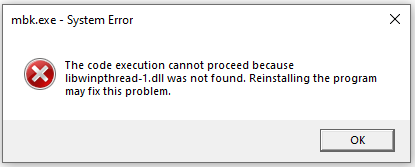
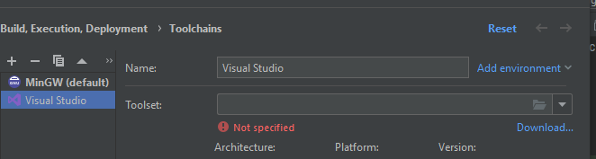
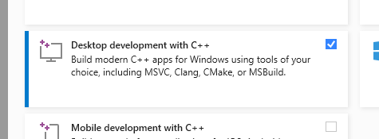

Had some issues when running on a new windows install where some expected dlls were not present but they were standard windows ones (I think).

- libwinpthread-1.dll
- libgcc_s_seh-1.dll
- libstdc++-6.dll



I tried to follow some advice (on main PC) from the following pages and docs but could not get it statically linked so that the .dll files were not required:

* https://stackoverflow.com/questions/28907304/cc1-exe-system-error-libwinpthread-1-dll-missing-but-it-isnt
* https://intellij-support.jetbrains.com/hc/en-us/community/posts/360000902679-libstdc-6-dll-is-missing
* https://stackoverflow.com/questions/13768515/how-to-do-static-linking-of-libwinpthread-1-dll-in-mingw
* https://cmake.org/cmake/help/latest/envvar/CXXFLAGS.html#envvar:CXXFLAGS
* https://cmake.org/cmake/help/latest/envvar/LDFLAGS.html

On the main PC, one thing I noticed was that when using `set(CMAKE_CXX_FLAGS "${CMAKE_CXX_FLAGS} -static")` I would get a message saying that the -static flag was being ignored and that the compiler being usedd was actually `cl.exe` not `gcc.exe`.

Looks like main used PC was using Visual studio Code to compile whereas this was not present on new Windows install.
This could be seen in the _Settings -> Build, Execution, Deployment -> CMake_ profiles.
I assume this was happening because Visual Studio was automatically detected and was present because I had used it to build the libsamplerate and fftw3 .lib files.

Tried changing main PC to use MinGW to compile but it wouldn't compile.

It might just be easier to install Visual Studio Code on new install and hope that solves it?

Installed Visual Studio from microsoft site and then restarting PC did not work for getting CLion to detect Visual Studio build toolchains.

Trying instead to download toolchain through links that CLion provides:


Using that installed, trying to include C++ build tools:


It's a fucking 2GB download and 8GB install, what a joke. Would be great to have a way to just install the required parts and not the whole thing but this is probably the easiest way.
Looks like it might just be possible to install the C++ build tools from https://visualstudio.microsoft.com/downloads/#build-tools-for-visual-studio-2022

So after restarting laptop (new install), deleting both the cmake-build-debug and cmake-build-release directories, I was able to get the build to find all of the correct tools but fail with the following error about target machine type/architecture:

```
C:\Users\glynh\avva\projects\JUCECmakeRepoPrototype\Apps\mbk\..\..\..\dependencies\fftw3.3.5-dll64\libfftw3-3.lib : warning LNK4272: library machine type 'x64' conflicts with target machine type 'x86'
C:\Users\glynh\avva\projects\JUCECmakeRepoPrototype\Apps\mbk\..\..\..\dependencies\libsamplerate-0.2.2-win64\samplerate.lib : warning LNK4272: library machine type 'x64' conflicts with target machine type 'x86'
```

Given the above, I believe that the reason we need to 32bit versions of the libraries is something due to the build setup.

Trying to set the dependencies back to 32bit 🤞:
```
target_link_directories(${TargetName} PRIVATE
        ../../../dependencies/libsamplerate-0.2.2-win32
        ../../../dependencies/fftw3.3.5-dll32
        )
```

Okay, fucking hell, that worked. Long.