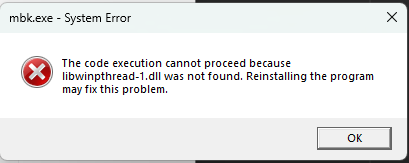

# Strange exit codes running app from CLion
```
C:\Users\g\avva\projects\JUCECmakeRepoPrototype\cmake-build-debug\Apps\mbk\mbk_artefacts\Debug\mbk.exe

Process finished with exit code -1073741515 (0xC0000135)
```

Running `C:\Users\g\avva\projects\JUCECmakeRepoPrototype\cmake-build-debug\Apps\mbk\mbk_artefacts\Debug\mbk.exe` from _Windows File Explorer_ shows that some dlls are missing.



List of dlls missing:
* `libwinpthread-1.dll`
* `libgcc_s_seh-1.dll`
* `libstdc++-6.dll`
* `libfftw3-3.dll`

Switched compiler to visual studio code and deleted `cmake-build-debug`.
Tried building mbk.
_File_ -> _Rebuild CMake Project_
Close CLion
`git clean -xdf`